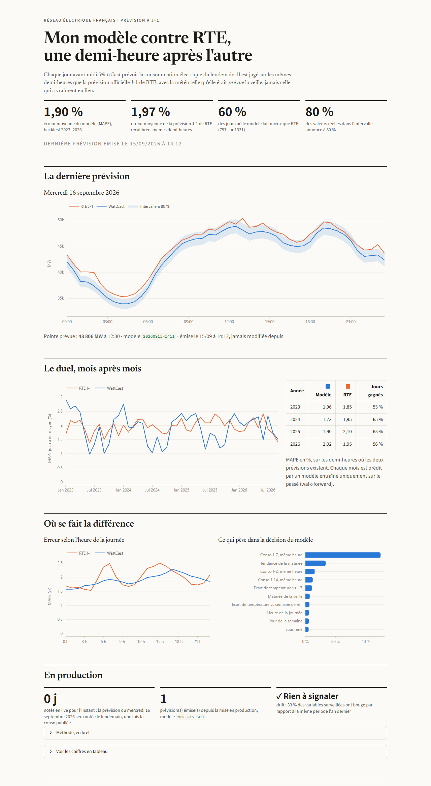
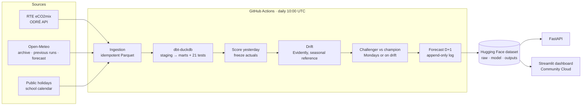

# WattCast

**Day-ahead forecasting of French electricity demand, running in production and scored every day against RTE's official forecast.**

[Live dashboard](https://wattcast.streamlit.app) · [Data & model state](https://huggingface.co/datasets/louey9999/wattcast-data) · [Daily pipeline](.github/workflows/daily.yml)



Every day before noon, a GitHub Actions pipeline pulls RTE's eCO2mix data and Open-Meteo forecasts, rebuilds a DuckDB warehouse with dbt, scores yesterday's forecasts, checks for drift, retrains if needed, and publishes a forecast of the 48 half-hours of the next day. Forecasts are logged once and never rewritten.

## Results

Walk-forward backtest, 1 January 2023 → 14 September 2026 (1,331 days, 63,880 half-hours). Each month is predicted by a model trained only on data available the day before, using the weather **as it was forecast** at the time, not the weather that actually happened.

| | MAPE | RMSE (MW) |
|---|---:|---:|
| **WattCast** (bias-calibrated) | **1.90 %** | 1,353 |
| RTE D-1 forecast (bias-calibrated) | 1.97 % | **1,262** |
| RTE D-1 forecast (raw) | 2.65 % | 1,641 |
| Seasonal naive (mean of D-7, D-14) | 6.36 % | 4,801 |
| Naive D-7 | 6.32 % | 4,804 |
| *WattCast with perfect weather (not a fair comparison)* | *1.75 %* | *1,239* |

**It is a tie, not a win.** WattCast has a slightly lower average error and beats RTE on 60 % of days (797 of 1,331), but RTE has the lower RMSE: WattCast is better on ordinary days and makes bigger mistakes on hard ones. The 80 % prediction interval contains the actual value 79.5 % of the time.

| Year | WattCast | RTE (calibrated) | Days won |
|---|---:|---:|---:|
| 2023 | 1.96 % | 1.85 % | 53 % |
| 2024 | 1.73 % | 1.95 % | 65 % |
| 2025 | 1.90 % | 2.10 % | 65 % |
| 2026 | 2.02 % | 1.95 % | 56 % |

### Where RTE wins

| Day type | Days | WattCast | RTE | Days won |
|---|---:|---:|---:|---:|
| Ordinary days | 1,259 | 1.84 % | 1.92 % | 60 % |
| Public holidays | 34 | 2.92 % | 3.08 % | 59 % |
| Bridge days | 10 | 2.15 % | 2.39 % | 40 % |
| Christmas period | 28 | 2.84 % | 2.38 % | 43 % |

The worst days tell the story: 1 May (11.4 % vs 3.8 % in 2025, the only holiday where almost everything closes), and sudden cold snaps such as 22 November 2025 (8.1 % vs 1.0 %), when temperature fell from 15 °C to 0 °C in a week and demand jumped 40 %. A model anchored on last week's level reacts too slowly to that; RTE, with its own heating-sensitivity models, does not.

## The bug that made me "beat RTE by 25 %"

My first backtest said WattCast had a 2.02 % error against 2.66 % for RTE, winning 67 % of days. RTE is one of the best load forecasters in the world, so I went looking for the catch before believing it.

Splitting the errors by quarter showed that RTE's forecast was **2 to 3 % below the consolidated consumption every single quarter**, and unbiased on the last three months, where only real-time data exists. RTE forecasts consumption *as measured in real time*; the consolidated figures published months later are revised upward. My model was trained on consolidated data, so it was winning on a definition, not on skill.

The fix treats both competitors the same way: each forecast is corrected by the median relative bias of its own errors over the previous four weeks, using only errors known at the forecast cutoff. Live forecasts are scored against the real-time value frozen on the day it is published, so the score cannot change when consolidated data arrives later. The biased first result is kept in [`backtest_metrics_v0_definition_bias.json`](https://huggingface.co/datasets/louey9999/wattcast-data/tree/main/outputs/france) for reference.

A third check found that about 5 % of the forecast-weather archive was missing (mostly Lille in 2022-2023) and had been silently filled with fresher forecasts. Missing cities are now dropped from the national average instead, and the 22 days where that is not enough are excluded from scoring for both competitors.

Error analysis then surfaced a real bug: the day after the switch to summer time, the "morning of the previous day" feature was computed on a 23-hour day missing its 2 a.m. trough, which inflated it and pushed forecasts up by several percent. It is fixed and covered by a test that fails on the old code. The same analysis motivated one new feature (temperature vs the reference week, for cold snaps). **This means the backtest period was used to design the model**, so it is no longer strictly out-of-sample; the live track record, which started on 15 September 2026, is.

The same audit caught a smaller leak: Open-Meteo's `previous_day1` forecast for an afternoon hour is issued the previous day *at that hour*, after the noon cutoff. Afternoon hours now use `previous_day2`, which is slightly more pessimistic than reality, never more optimistic.

## Architecture



## Forecasting protocol

The forecast for day D is produced at **D-1, 12:00 Paris time**. A feature may only use what is published at that moment:

| Information | Available at cutoff |
|---|---|
| Consumption | all of D-2 and before, D-1 until 11:00 |
| Weather for D and D-1 | forecast only |
| Weather for D-2 and before | observed |
| Calendar (holidays, bridges, school holidays) | fully known |

This rule is enforced by [`test_no_leakage_from_after_cutoff`](tests/test_features.py): it sabotages every value published after the cutoff and asserts that no feature of day D changes. I checked that the test fails when a D-1 lag is introduced on purpose.

## Decisions & trade-offs

- **LightGBM rather than deep learning.** About 220k half-hourly rows and strongly structured features (lags, calendar, temperature). Gradient boosting trains a walk-forward fold in seconds, which makes a 51-fold backtest cheap enough to rerun monthly in CI.
- **Predict a ratio, not megawatts.** The target is consumption divided by the mean of the last seven known days. French demand dropped 5 to 8 % during the 2022-2023 energy crisis; tree models cannot extrapolate a level they have never seen, a ratio can.
- **Weather in two views.** Training uses observed weather (13 years of history); the backtest and live forecasts use forecast weather (available from 2021). The "perfect weather" row in the results measures what forecast errors cost.
- **Online conformal intervals.** The half-width is the 80 % quantile of recent out-of-sample errors. No distributional assumption, and coverage is measured, not assumed.
- **Drift against the same season last year.** Comparing September to July flags temperature drift every time. Daily aggregates are compared to the same 28-day window a year earlier, and a performance signal (live error vs backtest error at the same season) is combined with the data signal.
- **Champion / challenger with a fair holdout.** A challenger is promoted only if it beats the champion on the last 8 weeks. The champion is judged on its real live forecasts when enough exist, otherwise on a replica retrained with the same cutoff, since the production version has already seen the holdout.
- **DuckDB + Parquet + a Hugging Face dataset.** Zero infrastructure cost, versioned state, and the warehouse is rebuilt from raw files on every run, so it can never drift from its sources.

## Known limitations

- RTE has data this project does not (real-time grid telemetry, industrial schedules, embedded solar estimates). The goal is to measure the gap honestly, not to claim a win.
- Only temperature is used from forecast weather: Open-Meteo archives D-1 forecasts of cloud cover, radiation and wind only from 2024, so those features were removed rather than filled with fresher data. Solar output therefore enters the model only through lags.
- Where the D-1 temperature archive has gaps for too many cities (22 days, mostly winter 2023-2024), fresher forecasts are used and the days are excluded from scoring (`temp_fc_filled`).
- The model is trained on consolidated data but scored live against real-time data; the online calibration absorbs the difference, and it needs about four weeks to settle after a definition change (visible in July 2026 in the backtest).
- School holidays are counted per zone (A, B, C), not weighted by population.

## API

```bash
just api   # or: docker build -t wattcast . && docker run -p 8000:8000 -v ./data:/app/data wattcast
```

| Endpoint | Returns |
|---|---|
| `GET /health` | champion version and last forecast day per country |
| `GET /forecast/{country}?day=YYYY-MM-DD` | the 48 half-hours as issued: forecast, 80 % interval, RTE D-1, actual once known |
| `GET /metrics/{country}` | backtest scores, live scores, latest drift report |

## Run it locally

```bash
uv sync
just ingest        # ~10 min the first time (2014 → today)
just dbt           # warehouse + 21 data tests
just backtest      # walk-forward, ~30 min
just train --promote
just predict
just dashboard     # http://localhost:8501
just api           # http://localhost:8000/docs
just test          # ruff + pytest
```

## What I'd do next

- Add Tunisia as a second, data-scarce country: monthly demand from STEG annual reports extracted with an LLM, with a hand-labelled evaluation set.
- Probabilistic forecasts per half-hour (quantile regression) instead of a single global interval width.
- Explicit solar self-consumption features, which drive the growing midday forecast error.
- A text-to-SQL analyst agent over the marts, evaluated on a fixed question set.

---

Data: RTE eCO2mix via [ODRÉ](https://odre.opendatasoft.com) · weather: [Open-Meteo](https://open-meteo.com) (CC BY 4.0) · school calendar: [data.education.gouv.fr](https://data.education.gouv.fr).
